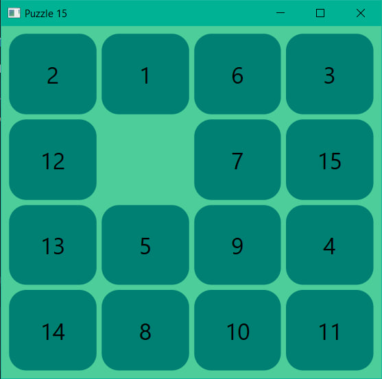
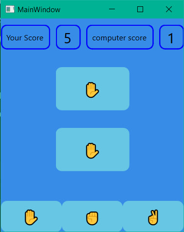
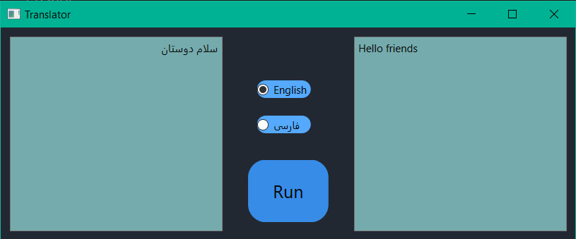
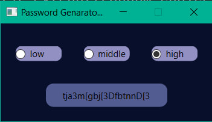
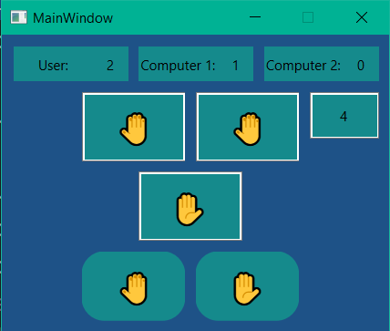
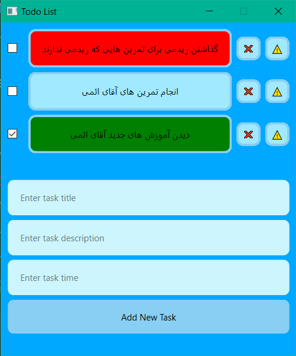
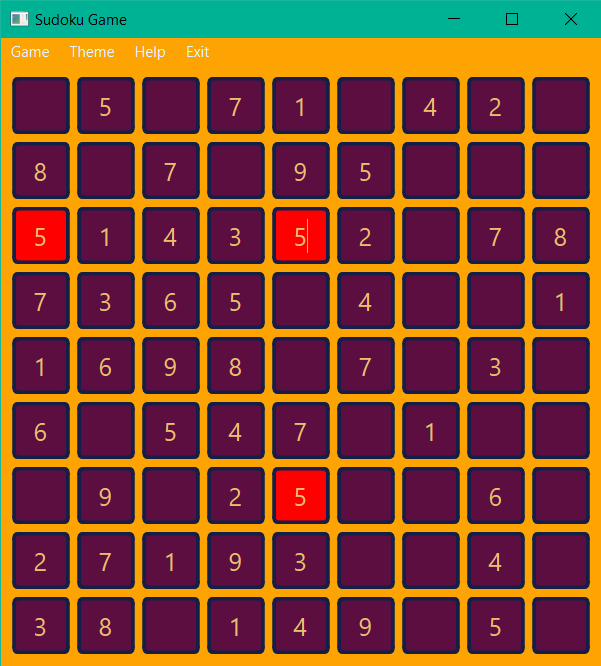
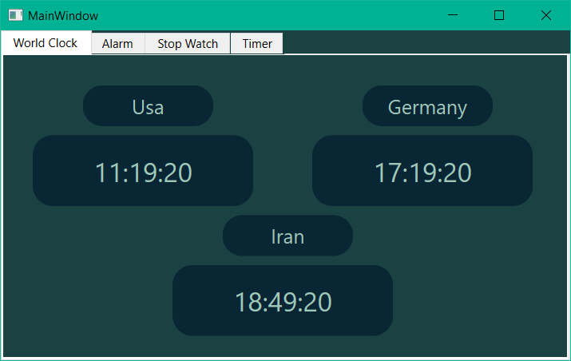

## 📺 User Interface

---

- Qt or PySide

---

### Assignments:

- [Assignment 17](Assignment_17) (Introductions):
    - [Introductions](Assignment_17)
- [Assignment 18](Assignment_18) (tictactoe):
    - [tictactoe](Assignment_18)
- [Assignment 19](Assignment_19) (Many Applications):
    - [Paper Rock Scissors Game](Assignment_19/paper_rock_scissors_game)
    - [Password Generator](Assignment_19/Password_Generator)
    - [Puzzle15](Assignment_19/Puzzle15)
    - [Translator](Assignment_19/Translator)
- [Assignment 20](Assignment_20) (SQL):
    - [SQL](Assignment_20/1-4%20SQL)
    - [Hand Game](Assignment_20/7)
- [Assignment 21](Assignment_21) (Shop Project with Database):
    - [Shop Project](Assignment_21/shop)
    - [Music](Assignment_21/music.py)
- [Assignment 22](Assignment_22) (Todo List):
    - [Todo List](Assignment_22)
- [Assignment 23](Assignment_23_3.1) (sudoku):
    - [sudoku](Assignment_23_3.1)
- [Assignment 24](Assignment_24_3.2) (Threading):
    - [interrstellar](Assignment_24_3.2/interrstellar)
    - [Movie sound](Assignment_24_3.2/movie%20to%20sound)
- [Assignment 25](Assignment_25_3.3) (Clock App):
    - [clock](Assignment_25_3.3)

---

