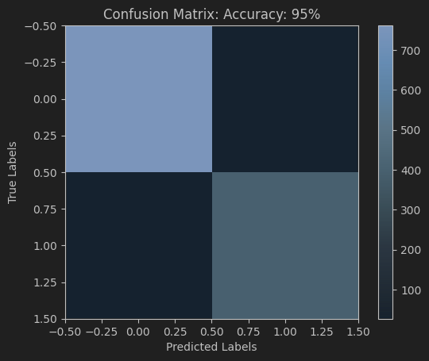
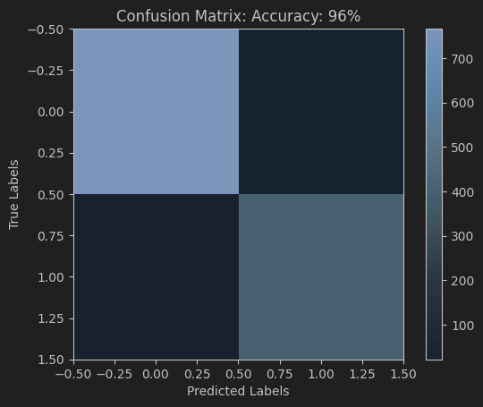
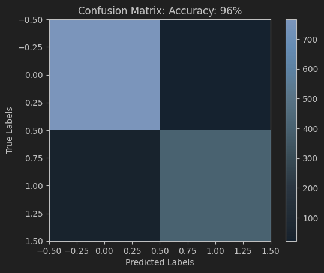
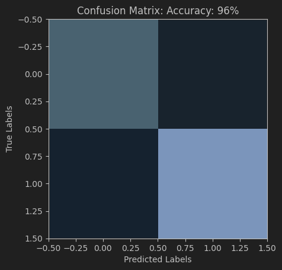

### KNN from scratch and Comparison with KNeighborsClassifier in SKlearn library

---

#### Dataset:

We use [ANSUR](https://www.kaggle.com/datasets/seshadrikolluri/ansur-ii) dataset in this program

---

#### Result:

| Model     | k = 3              | k = 5              | k = 7              |
|-----------|--------------------|--------------------|--------------------|
| Sklean    | 0.9546952224052718 | 0.9604612850082372 | 0.9604612850082372 |
| New model | 0.9546952224052718 | 0.9588138385502472 | 0.9612850082372323 |                 |

---

#### confusion matrix:

- New model with K3:

- New model with K5:

- New model with K7:

- SKlearn with K3:

- SKlearn with K5:

- SKlearn with K7:
