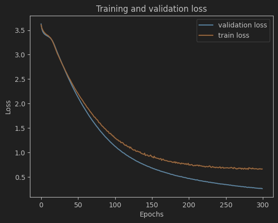
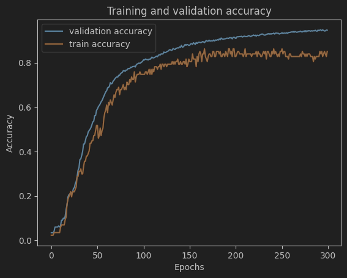

## Iranian face classification.

---

- This project use ArcFace model from DeepFace for feature extraction and classifier with MLP.

### Result with ArcFace model 512 feature:

| Data       | Accuracy | Loss   | 
|------------|----------|--------|
| Train      | 0.9492   | 0.2416 |
| Validation | 0.8506   | 0.6603 |
| Test       | 0.8714   | 0.5817 |

