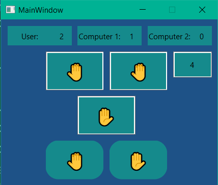

# SQL

---

create datebase and set query with sql

 name    | sql name | description            
---------|----------|------------------------
 query 1 | INSERT   | add data to database   
 query 2 | SELECT   | get data from database 
 query 3 | DELETE   | delete data            
 query 4 | UPDATE   | update data            

# Symmetric array detection

---

Normal function detection program with symmetric function.

 list            | out put 
-----------------|---------
 [1, 4, 3, 4, 1] | True    
 [1, 2, 3]       | False   

# Zip two lists randomly

---
inputs:

boys = [mohammad, sobhan, ...]
girls = [mahtab, hane, harir, ...]

output:

results = [(sajjad, soghra), (abdollah, minoo) , …]

# Symmetric array detection

---

The game "Palam, Polum, Pilish".




To run the programs, you need to install the following packages:

```
pip install pyside6 sqlite3
```