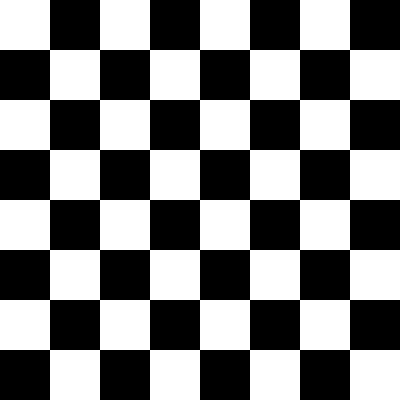

# Introduction with OpenCV

---

#### miny project about image processing and computer vision

1. create ches board.

2. create death symbol.

3. create E character.

4. create gradient.

5. invert color.

6. rotate image.

