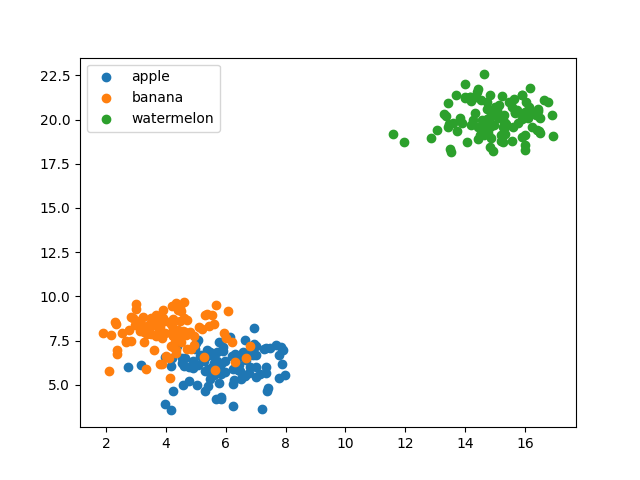

## K-Nearest Neighbors from scratch

- Implementation of KNN algorithm to predict several different classes

### Give dataset to mode

### Predict model:

| X  | Y  | Predict    |
|----|----|------------|
| 5  | 5  | Apple      |
| 12 | 18 | Watermelon |
| 5  | 9  | Banana     |