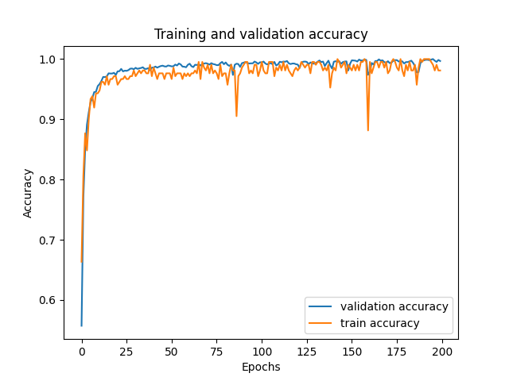
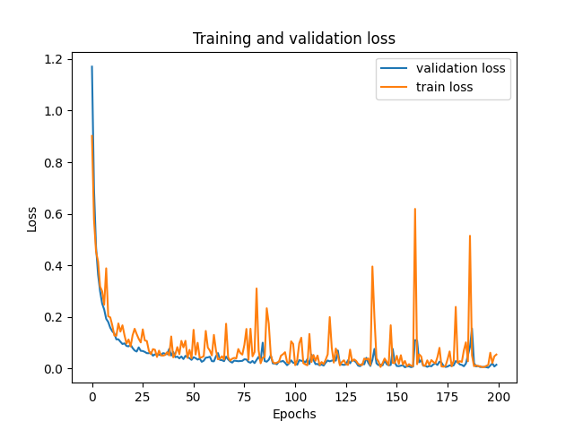

## Snake Game With Machine Learning

---

- There are 3 program modes in this project. It is a mode with user control. Another mode is using conditional commands
  for control. The last mode is program control with neural network.

### Install Dependencies:

```shell
pip install -r requirements.txt
```

### Config Project:

#### in config.py:

- WINDOW_WIDTH: width of window.
- WINDOW_HEIGHT: height of window.
- MODE: Set Program Mode:
    - Manual: Control with user.
    - AI: Control with conditional commands.
    - ML: Control with Neural Network.
- COLLECT_DATASET: collect dataset.
    - attention: collect dataset most be with AI Mode!
- SAVE_DATASET: dataset save path.
- SNAKE_SPEED: snake speed.
- SNACK_RADIUS: snake size.
- APPLE_IMAGE: image of apple.
- APPLE_SIZE: apple size.

#### Train Neural Network:

- train_model.py read dataset and train model.

#### Train config:

- layer 1: 4 to 128 size. activation: relu
- layer 2: 128 to 64 size. activation: relu
- layer 3: 64 to 32 size. activation: relu
- layer 4: 32 to 4 size. activation: softmax
- Optimizer: Adam.
- Learning Rate: 0.001.
- Loss: sparse categorical crossentropy.
- Epochs: 200.

#### Result Train Model.

| Data       | Loss   | Accuracy |
|------------|--------|----------|
| Train      | 0.0487 | 1.       |
| Validation | 0.0357 | 99.8567  |
| Test       | 0.0339 | 99.3274  |



